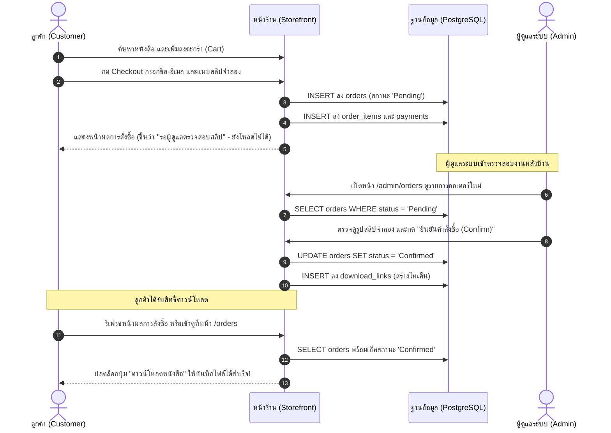

# 📚 เอกสารโครงงานพัฒนาระบบฐานข้อมูล: ร้านขายหนังสือและอีบุ๊กออนไลน์ (Lampara Books)

---

### 📋 ข้อมูลโครงงานและข้อมูลรายวิชา
* **รหัสวิชา:** `[31-407-102-301]`
* **ชื่อวิชา:** ระบบฐานข้อมูล (Database Systems) | หน่วยกิต: (2-1-3)
* **กลุ่มเรียน:** ECP3N | ห้องเรียน: ECP 321
* **อาจารย์ผู้สอน:** อาจารย์ประภาส ผ่องสนาม (ประเภททฤษฎี)
* **ชื่อโครงงาน:** ระบบร้านขายหนังสือและอีบุ๊กออนไลน์ (Lampara Books Digital Store)
* **ผู้จัดทำและผู้นำเสนอ:** นายกานต์นิธิ ยะโส รหัสนักศึกษา `67332110223-9` กลุ่ม ECP3N
* **🌐 เว็บไซต์จริงบน Vercel (Live Demo):** [https://lampara-books.vercel.app](https://lampara-books.vercel.app) *(สำรอง: [https://booksell-database.vercel.app](https://booksell-database.vercel.app))*
* **โครงงานที่เชื่อมโยง (SWE Project):** โครงงานระบบ Inventory System ในรายวิชาวิศวกรรมซอฟต์แวร์ (อ.ดร.ปิยะนุช ตั้งกิตติพล) จัดเก็บอยู่ที่ Repository: [https://github.com/FirstXCH/team-13-inventory](https://github.com/FirstXCH/team-13-inventory)

---

<details>
<summary><b>📖 เอกสารคู่มือเตรียมตัวสอบและภาพรวมการนำเสนอ (Local Study & Defense Guide)</b> <i>[คลิกเพื่อเปิดดู]</i></summary>

> *หมายเหตุ: เอกสารชุด STEP_01 - STEP_04 เป็นบันทึกเตรียมตัวสอบและแนวทางการตอบคำถามส่วนบุคคล จัดเก็บไว้ใช้งานในเครื่อง (Local Revision Guide)*
> 
> 1. **STEP_01: ภาพรวมระบบและแนวทางตอบคำถามสอบ (Overview & Defense Q&A)** — สรุปสถาปัตยกรรม ERD, 3NF, สรุป 3-Tier และแนวทางตอบคำถามสอบ
> 2. **STEP_02: เล่มรายงานโครงงานฐานข้อมูลฉบับสมบูรณ์ (Full Academic Report)** — รายงานทางการ 7 บทครบถ้วนตามใบงาน (เอกสารทางการ: [`รายงาน_Mini_Project_Database_ร้านขาย_E-Book_2026.pdf`](รายงาน_Mini_Project_Database_ร้านขาย_E-Book_2026.pdf))
> 3. **STEP_03: พจนานุกรมข้อมูลและการทดสอบระบบ (Data Dictionary & 8 Test Cases)** — รายละเอียด 9 ตาราง และกรณีทดสอบความถูกต้องของข้อมูล (ดูฉบับตรวจประเมินได้ที่ [`docs/data-dictionary.md`](docs/data-dictionary.md) และ [`docs/test-cases.md`](docs/test-cases.md))
> 4. **STEP_04: คำสั่ง SQL วิเคราะห์รายงาน 4 ด้าน (Analytical Queries)** — สคริปต์คำสั่ง SQL ขั้นสูงพร้อมผลลัพธ์และคำอธิบายทางธุรกิจ (สคริปต์ SQL หลักจัดเก็บที่ [`sql/`](sql/))

</details>

---

## 📑 สารบัญเนื้อหา (Table of Contents)
1. [บทนำและภาพรวมของระบบจากศูนย์ (Introduction & System Domain)](#1-บทนำและภาพรวมของระบบจากศูนย์)
2. [การออกแบบฐานข้อมูลเชิงแนวคิดและภาพรวม ER (ER Diagram & Modeling)](#2-การออกแบบฐานข้อมูลเชิงแนวคิดและภาพรวม-er)
3. [ทฤษฎีการปรับแบบข้อมูลสู่รูปบรรทัดฐานที่ 3 (Database Normalization to 3NF)](#3-ทฤษฎีการปรับแบบข้อมูลสู่รูปบรรทัดฐานที่-3-3nf)
4. [พจนานุกรมข้อมูลฉบับสมบูรณ์ 9 ตาราง (Data Dictionary)](#4-พจนานุกรมข้อมูลฉบับสมบูรณ์-9-ตาราง-data-dictionary)
5. [สคริปต์ฐานข้อมูล DDL, Constraints และนโยบายความปลอดภัย (DDL & Security)](#5-สคริปต์ฐานข้อมูล-ddl-constraints-และนโยบายความปลอดภัย)
6. [ข้อมูลตัวอย่างและสคริปต์รายงานวิเคราะห์ 4 ด้าน (Seed Data & Analytical Queries)](#6-ข้อมูลตัวอย่างและสคริปต์รายงานวิเคราะห์-4-ด้าน)
7. [การเชื่อมโยงฐานข้อมูลกับโค้ดแอปพลิเคชัน (Data Access Layer & Backend Integration)](#7-การเชื่อมโยงฐานข้อมูลกับโค้ดแอปพลิเคชัน)
8. [ส่วนติดต่อผู้ใช้และสถาปัตยกรรมหน้าร้าน/หลังบ้าน (Frontend Architecture & Flows)](#8-ส่วนติดต่อผู้ใช้และสถาปัตยกรรมหน้าร้านหลังบ้าน)
9. [แผนการทดสอบและประกันคุณภาพข้อมูล (8 Test Cases)](#9-แผนการทดสอบและประกันคุณภาพข้อมูล)
10. [บันทึกการประยุกต์ใช้ AI อย่างรับผิดชอบ (Responsible AI Usage Log)](#10-บันทึกการประยุกต์ใช้-ai-อย่างรับผิดชอบ)
11. [คู่มือการนำเสนอและการตอบคำถามสอบโปรเจกต์ (Defense Q&A Guide)](#11-คู่มือการนำเสนอและการตอบคำถามสอบโปรเจกต์)

---

## 1. บทนำและภาพรวมของระบบจากศูนย์

### 1.1 ที่มาและปัญหาของระบบขายหนังสือดิจิทัล
การขายหนังสือดิจิทัล (E-Book) แตกต่างจากการขายสินค้าทางกายภาพ (Physical Goods) อย่างสิ้นเชิงในมิติของฐานข้อมูล:
1. **ไม่มีสินค้าคงคลังทางกายภาพ (Zero Physical Stock):** สินค้าดิจิทัลไม่มีวันหมดสต็อก แต่มีเรื่อง **"ลิขสิทธิ์และการควบคุมสิทธิ์เข้าถึง (Access Control)"** เข้ามาแทนที่
2. **เงื่อนไขการส่งมอบสินค้า (Fulfillment Constraint):** ลูกค้าจะได้รับสินค้าในรูปแบบ **"ลิงก์หรือโทเค็นสำหรับดาวน์โหลดไฟล์"** ซึ่งต้องถูกควบคุมอย่างเข้มงวด โดยระบบจะต้อง **ไม่อนุญาตให้เปิดลิงก์ดาวน์โหลด หากคำสั่งซื้อยังไม่ได้รับการตรวจสอบและยืนยันจากผู้ดูแลระบบ**
3. **การเปลี่ยนแปลงของราคาสินค้า (Price Volatility):** ราคาหนังสือในแคตตาล็อกอาจมีการปรับขึ้นลง หรือมีโปรโมชันในอนาคต แต่ในตารางประวัติคำสั่งซื้อ ยอดเงินที่ลูกค้าซื้อ ณ วันนั้นต้อง **คงที่ถาวร (Price Immutability)** เสมอ

### 1.2 วัตถุประสงค์ของโครงงาน
* ออกแบบฐานข้อมูลเชิงสัมพันธ์ (Relational Database Management System - RDBMS) บนมาตรฐาน **PostgreSQL** ให้ถูกต้องตามกฎการปรับแบบข้อมูล (3NF)
* พัฒนาระบบที่มีจำนวนตาราง **9 ตาราง** (เกินเกณฑ์ขั้นต่ำ 8 ตารางตามใบงาน)
* สร้างข้อมูลจำลองที่มีความสมเหตุสมผลมากกว่า **35 คำสั่งซื้อ** ครอบคลุมหลากหลายสถานะและช่วงเวลา
* ออกแบบ Query ภาษา SQL ขั้นสูงเพื่อสร้าง **รายงานวิเคราะห์ 4 ด้าน** เพื่อสนับสนุนการตัดสินใจของผู้บริหาร
* พัฒนาระบบเว็บเชื่อมต่อฐานข้อมูลจริง รองรับทั้งเส้นทางการทำงานของ **ลูกค้า (Customer)** และ **ผู้ดูแลระบบ (Admin)**

### 1.3 สถาปัตยกรรมระบบและชุดเทคโนโลยี (System Architecture & Technology Stack)

ระบบถูกออกแบบและพัฒนาภายใต้สถาปัตยกรรม **3-Tier System Architecture** ที่แบ่งแยกหน้าที่การทำงานอย่างเป็นสัดส่วน พร้อมเครื่องมือพัฒนาและทดสอบครบวงจร:


* **Tier 1 (Client / Frontend):** พัฒนาด้วย Next.js (App Router), React, TypeScript และ Tailwind CSS สำหรับส่วนติดต่อผู้ใช้งานและจัดการสถานะ
* **Tier 2 (Hosting / Platform):** รองรับการโฮสต์ระดับ Edge บน Vercel พร้อม GitHub สำหรับการควบคุมเวอร์ชันและการทำงานร่วมกัน
* **Tier 3 (Database / Backend):** จัดการฐานข้อมูลเชิงสัมพันธ์ด้วย PostgreSQL (Supabase Cloud), Supabase Storage และโครงสร้าง 9 ตารางตามเกณฑ์ 3NF
* **Testing & Tools:** เครื่องมือทดสอบอัตโนมัติ End-to-End ด้วย Playwright และการจำลองผังฐานข้อมูลด้วย dbdiagram.io

---

## 2. การออกแบบฐานข้อมูลเชิงแนวคิดและภาพรวม ER

โครงสร้างฐานข้อมูลของระบบ **Lampara Books** ประกอบด้วย 9 ตารางหลัก ที่มีความสัมพันธ์กันอย่างเป็นระเบียบตามหลักการออกแบบฐานข้อมูลเชิงสัมพันธ์

### 2.1 แผนภาพความสัมพันธ์เอนทิตี (Entity-Relationship Diagram: ERD)


### 2.2 ตารางสรุปการเชื่อมโยงคีย์และความสัมพันธ์ (PK-to-FK Mapping Reference)

| ลำดับ | ตารางต้นทาง (Parent / PK) | คอลัมน์ PK | ตารางปลายทาง (Child / FK) | คอลัมน์ FK | อัตราส่วน (Cardinality) | กฎเมื่อลบข้อมูล (ON DELETE) | คำอธิบายเชิงธุรกิจ (Business Rule) |
|:---:|---|---|---|---|:---:|:---:|---|
| 1 | **ROLES** | `id` | **USERS** | `role_id` | **1 : N** | `RESTRICT` | กำหนดบทบาทผู้ใช้ (Admin หรือ Customer) แต่ละคนมี 1 บทบาท |
| 2 | **USERS** | `id` | **ORDERS** | `user_id` | **1 : N** | `SET NULL` | ลูกค้าสมาชิก 1 คน สั่งซื้อได้หลายครั้ง (ถ้าเป็น Guest จะเป็น `NULL`) |
| 3 | **ORDERS** | `id` | **PAYMENTS** | `order_id` | **1 : 1** | `CASCADE` | คำสั่งซื้อ 1 ใบ ผูกติดกับบันทึกการชำระเงิน 1 รายการ (`order_id` เป็น UNIQUE) |
| 4 | **AUTHORS** | `id` | **BOOKS** | `author_id` | **1 : N** | `RESTRICT` | นักเขียน 1 ท่าน สามารถมีผลงานหนังสือในระบบได้หลายเล่ม |
| 5 | **CATEGORIES** | `id` | **BOOKS** | `category_id` | **1 : N** | `RESTRICT` | หมวดหมู่ 1 หมวดหมู่ บรรจุหนังสือได้หลายเล่ม |
| 6 | **ORDERS** | `id` | **ORDER_ITEMS** | `order_id` | **1 : N** | `CASCADE` | คำสั่งซื้อ 1 ใบ ประกอบด้วยรายการสินค้าหนังสือได้หลายรายการ |
| 7 | **BOOKS** | `id` | **ORDER_ITEMS** | `book_id` | **1 : N** | `RESTRICT` | หนังสือ 1 เล่ม ปรากฏในรายการสั่งซื้อของลูกค้าได้หลายคำสั่งซื้อ |
| 8 | **ORDERS** | `id` | **DOWNLOAD_LINKS** | `order_id` | **1 : N** | `CASCADE` | คำสั่งซื้อที่ชำระเงินแล้วจะออกลิงก์ดาวน์โหลดตามรายการที่สั่ง |
| 9 | **BOOKS** | `id` | **DOWNLOAD_LINKS** | `book_id` | **1 : N** | `CASCADE` | ลิงก์ดาวน์โหลดอ้างอิงไฟล์หนังสือเป้าหมายที่ลูกค้ามีสิทธิ์โหลด |

---

## 3. ทฤษฎีการปรับแบบข้อมูลสู่รูปบรรทัดฐานที่ 3 (3NF)

การออกแบบฐานข้อมูลนี้ผ่านการวิเคราะห์กระบวนการ Normalization ตั้งแต่ขั้นต้นจนถึง Third Normal Form (3NF) เพื่อขจัดปัญหาความซ้ำซ้อนของข้อมูล (Data Redundancy) และความผิดปกติในการจัดการข้อมูล (Insertion, Update, Deletion Anomalies) ดังนี้:

### 3.1 จากตารางรวมที่ยังไม่ปรับบรรทัดฐาน (Unnormalized Form - UNF)
หากเราออกแบบฐานข้อมูลแบบง่ายโดยเก็บข้อมูลทุกอย่างไว้ในตารางเดียว เช่น `all_sales_data`:
*(order_id, user_email, user_name, user_role, author_name, author_bio, book_title, category_name, price, order_date, slip_image)*
* **ปัญหาที่เกิดขึ้น:** มีข้อมูลซ้ำซ้อนมหาศาล ชื่อผู้แต่งและชีวประวัติต้องพิมพ์ซ้ำทุกครั้งที่มีการซื้อหนังสือเล่มนั้น หากต้องการแก้ชีวประวัตินักเขียนคนเดียว ต้องอัปเดตหลายหมื่นแถว (Update Anomaly)

### 3.2 รูปบรรทัดฐานขั้นที่ 1 (First Normal Form - 1NF)
* **กฎเกณฑ์:** ทุกคอลัมน์ต้องเก็บค่าที่เป็น **Atomic Value** (ค่าเดี่ยว ไม่เป็น Multi-valued หรือ Array) และต้องมี Primary Key ที่ระบุแต่ละแถวได้อย่างไม่ซ้ำซ้อน
* **การนำไปใช้:**
  - แยกรายการสินค้าในคำสั่งซื้อที่เดิมอาจเป็นข้อความยาวๆ รวมกัน ออกมาเป็นตาราง `order_items` โดยแต่ละแถวแทนหนังสือ 1 เล่มต่อ 1 รายการสั่งซื้อ
  - กำหนด Primary Key (`id`) ให้กับทุกตารางชัดเจน

### 3.3 รูปบรรทัดฐานขั้นที่ 2 (Second Normal Form - 2NF)
* **กฎเกณฑ์:** ต้องผ่าน 1NF แล้ว และ **ทุกคอลัมน์ที่ไม่ใช่คีย์หลัก (Non-key attributes) ต้องขึ้นตรงต่อคีย์หลักทั้งตัว (Fully Functional Dependency)** ไม่ขึ้นกับส่วนใดส่วนหนึ่งของคีย์ผสม (No Partial Dependency)
* **การนำไปใช้:**
  - ตาราง `order_items` เดิมถ้าใช้คีย์ผสม `(order_id, book_id)` แล้วเก็บชื่อหนังสือ `title` ราคาหนังสือ `price` ฟิลด์เหล่านั้นจะขึ้นกับ `book_id` เท่านั้น ไม่ได้ขึ้นกับ `order_id`
  - จึงทำการแยกตาราง `books` ออกมาเป็นเอกเทศ และใน `order_items` คงเหลือไว้เพียง Foreign Key `book_id` และเก็บราคา ณ ขณะนั้น `price_at_time` ซึ่งขึ้นกับคู่ลำดับการซื้อนั้นโดยแท้จริง

### 3.4 รูปบรรทัดฐานขั้นที่ 3 (Third Normal Form - 3NF)
* **กฎเกณฑ์:** ต้องผ่าน 2NF แล้ว และ **ต้องไม่มีการขึ้นต่อกันระหว่างฟิลด์ที่ไม่ใช่คีย์ด้วยกันเอง (No Transitive Functional Dependency)** นั่นคือ $X \rightarrow Y$ และ $Y \rightarrow Z$ ไม่ควรเกิดขึ้นในตารางเดียวกัน
* **การนำไปใช้ในระบบ Lampara Books:**
  1. **แยกตาราง `authors` ออกจาก `books`:** เดิมข้อมูลใน `books` มีชื่อผู้แต่งและชีวประวัติ ซึ่งขึ้นอยู่กับตัวผู้แต่ง ไม่ได้ขึ้นตรงกับรหัสหนังสือ เมื่อแยกเป็นตาราง `authors` แล้วให้ `books` ถือเพียง `author_id` (FK) จึงตัด Transitive Dependency ได้อย่างสมบูรณ์
  2. **แยกตาราง `categories` ออกจาก `books`:** ชื่อและคำอธิบายหมวดหมู่ ขึ้นกับรหัสหมวดหมู่ จึงแยกเป็นตาราง `categories`
  3. **แยกตาราง `roles` ออกจาก `users`:** สิทธิ์และคำอธิบายบทบาท แยกออกมาเพื่อให้สามารถบริหารจัดการสิทธิ์ได้อย่างเป็นระบบ
  4. **แยกตาราง `payments` ออกจาก `orders`:** ข้อมูลวิธีการชำระเงิน วันที่ตรวจสลิป และรูปสลิป ขึ้นกับการทำธุรกรรมชำระเงิน จึงแยกเป็นตารางอิสระ

> [!TIP]
> **ทำไมฟิลด์ `price_at_time` ใน `order_items` จึงไม่ผิดกฎ 3NF?**
> ในทางทฤษฎีฐานข้อมูล การเก็บราคาไว้ใน `order_items` ซ้ำกับ `books.price` ไม่ถือเป็น Data Redundancy แต่เป็น **"Historical Fact (ข้อเท็จจริงทางประวัติศาสตร์)"** เพราะราคาหนังสือในตาราง `books` สามารถเปลี่ยนแปลงได้ตลอดเวลา แต่ราคาที่ลูกค้าทำการตกลงซื้อขายในอดีตต้องคงที่และไม่เปลี่ยนแปลงตามราคาปัจจุบัน

---

## 4. พจนานุกรมข้อมูลฉบับสมบูรณ์ 9 ตาราง (Data Dictionary)

### 1) ตาราง `roles` (บทบาทผู้ใช้งาน)
เก็บบทบาทและสิทธิ์การเข้าถึงระบบ เพื่อจำแนกผู้ใช้ระหว่างลูกค้าทั่วไปกับผู้ดูแลระบบ
* **Primary Key:** `id`
* **Foreign Keys:** ไม่มี

| ชื่อฟิลด์ | ชนิดข้อมูล | เงื่อนไข (Constraints) | ค่าเริ่มต้น | คำอธิบาย |
|---|---|---|---|---|
| `id` | SERIAL | PRIMARY KEY | Auto | รหัสประจำบทบาท |
| `name` | VARCHAR(50) | UNIQUE, NOT NULL | - | ชื่อบทบาท เช่น 'Admin', 'Customer' |
| `description` | TEXT | NULLABLE | NULL | คำอธิบายสิทธิ์หน้าที่ของบทบาท |
| `created_at` | TIMESTAMPTZ | NOT NULL | CURRENT_TIMESTAMP | วันที่และเวลาที่สร้างบทบาท |

---

### 2) ตาราง `users` (ผู้ใช้งานระบบ)
เก็บข้อมูลสมาชิกของระบบ ทั้งลูกค้าและผู้ดูแลร้าน
* **Primary Key:** `id`
* **Foreign Keys:** `role_id` อ้างอิงไปยัง `roles(id)`

| ชื่อฟิลด์ | ชนิดข้อมูล | เงื่อนไข (Constraints) | ค่าเริ่มต้น | คำอธิบาย |
|---|---|---|---|---|
| `id` | SERIAL | PRIMARY KEY | Auto | รหัสประจำตัวผู้ใช้งาน |
| `role_id` | INT | NOT NULL, REFERENCES roles(id) ON DELETE RESTRICT | - | รหัสบทบาทหน้าที่ |
| `email` | VARCHAR(255) | UNIQUE, NOT NULL | - | อีเมลสำหรับเข้าสู่ระบบ |
| `password_hash` | VARCHAR(255) | NOT NULL | - | รหัสผ่านที่ผ่านการแฮชเพื่อความปลอดภัย |
| `full_name` | VARCHAR(150) | NOT NULL | - | ชื่อและนามสกุลจริงของผู้ใช้งาน |
| `phone` | VARCHAR(30) | NULLABLE | NULL | เบอร์โทรศัพท์สำหรับติดต่อ |
| `created_at` | TIMESTAMPTZ | NOT NULL | CURRENT_TIMESTAMP | วันที่สมัครสมาชิก |
| `updated_at` | TIMESTAMPTZ | NOT NULL | CURRENT_TIMESTAMP | วันที่แก้ไขข้อมูลล่าสุด |

---

### 3) ตาราง `authors` (ข้อมูลนักเขียน / ผู้แต่ง)
เก็บประวัติและข้อมูลนักเขียน เพื่อรองรับการค้นหาผลงานตามนักเขียน
* **Primary Key:** `id`
* **Foreign Keys:** ไม่มี

| ชื่อฟิลด์ | ชนิดข้อมูล | เงื่อนไข (Constraints) | ค่าเริ่มต้น | คำอธิบาย |
|---|---|---|---|---|
| `id` | SERIAL | PRIMARY KEY | Auto | รหัสประจำตัวนักเขียน |
| `name` | VARCHAR(150) | NOT NULL | - | ชื่อ-นามสกุล หรือนามปากกาของนักเขียน |
| `bio` | TEXT | NULLABLE | NULL | ประวัติและข้อมูลผลงานโดยสังเขป |
| `email` | VARCHAR(255) | NULLABLE | NULL | อีเมลติดต่อของนักเขียน |
| `avatar_url` | VARCHAR(500) | NULLABLE | NULL | ลิงก์รูปภาพประจำตัวนักเขียน |
| `created_at` | TIMESTAMPTZ | NOT NULL | CURRENT_TIMESTAMP | วันที่บันทึกข้อมูล |

---

### 4) ตาราง `categories` (หมวดหมู่หนังสือ)
เก็บหมวดหมู่เพื่อใช้ในการจัดกลุ่มและคัดกรองหนังสือ
* **Primary Key:** `id`
* **Foreign Keys:** ไม่มี

| ชื่อฟิลด์ | ชนิดข้อมูล | เงื่อนไข (Constraints) | ค่าเริ่มต้น | คำอธิบาย |
|---|---|---|---|---|
| `id` | SERIAL | PRIMARY KEY | Auto | รหัสหมวดหมู่หนังสือ |
| `name` | VARCHAR(100) | UNIQUE, NOT NULL | - | ชื่อหมวดหมู่ภาษาไทย (เช่น นวนิยาย, เทคโนโลยี) |
| `slug` | VARCHAR(100) | UNIQUE, NOT NULL | - | URL Slug ภาษาอังกฤษ (เช่น fiction, technology) |
| `description` | TEXT | NULLABLE | NULL | คำอธิบายรายละเอียดของหมวดหมู่ |
| `created_at` | TIMESTAMPTZ | NOT NULL | CURRENT_TIMESTAMP | วันที่สร้างหมวดหมู่ |

---

### 5) ตาราง `books` (ข้อมูลหนังสือและอีบุ๊ก)
ตารางหลักสำหรับเก็บรายละเอียดแคตตาล็อกหนังสือทั้งหมดในร้าน
* **Primary Key:** `id`
* **Foreign Keys:** 
  * `author_id` อ้างอิงไปยัง `authors(id)` ON DELETE SET NULL
  * `category_id` อ้างอิงไปยัง `categories(id)` ON DELETE SET NULL

| ชื่อฟิลด์ | ชนิดข้อมูล | เงื่อนไข (Constraints) | ค่าเริ่มต้น | คำอธิบาย |
|---|---|---|---|---|
| `id` | SERIAL | PRIMARY KEY | Auto | รหัสหนังสือ (Book ID) |
| `title` | VARCHAR(255) | NOT NULL | - | ชื่อเรื่องหนังสือ |
| `author_id` | INT | REFERENCES authors(id) ON DELETE SET NULL | NULL | รหัสผู้แต่ง (เชื่อมตาราง authors) |
| `category_id` | INT | REFERENCES categories(id) ON DELETE SET NULL | NULL | รหัสหมวดหมู่ (เชื่อมตาราง categories) |
| `price` | DECIMAL(10,2) | NOT NULL, CHECK (price >= 0) | - | ราคาขายของหนังสือ (ต้องไม่ติดลบ) |
| `cover_color` | VARCHAR(20) | NULLABLE | '#2F5D50' | โทนสีธีมสำหรับหน้าปก |
| `cover_image` | VARCHAR(500) | NULLABLE | NULL | ลิงก์รูปภาพหน้าปกหนังสือ |
| `description` | TEXT | NULLABLE | NULL | เรื่องย่อหรือคำอธิบายเนื้อหาหนังสือ |
| `pages` | INT | CHECK (pages >= 0) | 0 | จำนวนหน้าหนังสือ |
| `language` | VARCHAR(50) | NOT NULL | 'ไทย' | ภาษาของเนื้อหา |
| `published_year`| INT | CHECK (published_year >= 1800) | - | ปี ค.ศ. ที่ตีพิมพ์ |
| `isbn` | VARCHAR(30) | UNIQUE, NULLABLE | NULL | รหัสมาตรฐานสากลประจำหนังสือ (ISBN) |
| `rating` | DECIMAL(2,1) | CHECK (rating >= 0 AND rating <= 5.0) | 5.0 | คะแนนรีวิวเฉลี่ย (0.0 ถึง 5.0) |
| `featured` | BOOLEAN | NOT NULL | FALSE | หนังสือแนะนำประจำหน้าแรก |
| `file_url` | VARCHAR(500) | NULLABLE | NULL | ลิงก์ไฟล์ตัวอย่างหรือไฟล์ดิจิทัล |
| `is_active` | BOOLEAN | NOT NULL | TRUE | สถานะพร้อมจำหน่าย (ใช้ทำ Soft Delete) |
| `created_at` | TIMESTAMPTZ | NOT NULL | CURRENT_TIMESTAMP | วันที่ลงรายการขาย |

---

### 6) ตาราง `orders` (คำสั่งซื้อหลัก)
เก็บส่วนหัวของคำสั่งซื้อ ข้อมูลผู้สั่ง และสถานะการดำเนินงาน
* **Primary Key:** `id`
* **Foreign Keys:** `user_id` อ้างอิงไปยัง `users(id)` ON DELETE SET NULL

| ชื่อฟิลด์ | ชนิดข้อมูล | เงื่อนไข (Constraints) | ค่าเริ่มต้น | คำอธิบาย |
|---|---|---|---|---|
| `id` | SERIAL | PRIMARY KEY | Auto | เลขที่คำสั่งซื้อ (Order #) |
| `user_id` | INT | REFERENCES users(id) ON DELETE SET NULL | NULL | รหัสสมาชิกผู้สั่งซื้อ (เว้นว่างได้ถ้าซื้อแบบ Guest) |
| `checkout_email`| VARCHAR(255) | NOT NULL | - | อีเมลสำหรับรับใบเสร็จและแจ้งสถานะ |
| `checkout_name` | VARCHAR(150) | NOT NULL | - | ชื่อผู้สั่งซื้อ |
| `total` | DECIMAL(10,2) | NOT NULL, CHECK (total >= 0) | - | ยอดรวมเงินสุทธิของคำสั่งซื้อ |
| `status` | VARCHAR(30) | CHECK (status IN ('Pending','Paid','Confirmed','Cancelled','Refunded')) | 'Pending' | สถานะคำสั่งซื้อ (Pending=รอตรวจสลิป, Confirmed=ยืนยันแล้ว) |
| `email_sent` | BOOLEAN | NOT NULL | TRUE | สถานะการส่งอีเมลยืนยันคำสั่งซื้อ |
| `created_at` | TIMESTAMPTZ | NOT NULL | CURRENT_TIMESTAMP | วันที่และเวลาที่สั่งซื้อ |
| `updated_at` | TIMESTAMPTZ | NOT NULL | CURRENT_TIMESTAMP | วันที่และเวลาที่มีการปรับปรุงสถานะ |

---

### 7) ตาราง `order_items` (รายการหนังสือในคำสั่งซื้อ)
เก็บรายการหนังสือแต่ละเล่มที่อยู่ในคำสั่งซื้อ พร้อมบันทึกราคาที่ซื้อ ณ ขณะนั้น
* **Primary Key:** `id`
* **Foreign Keys:**
  * `order_id` อ้างอิงไปยัง `orders(id)` ON DELETE CASCADE
  * `book_id` อ้างอิงไปยัง `books(id)` ON DELETE RESTRICT

| ชื่อฟิลด์ | ชนิดข้อมูล | เงื่อนไข (Constraints) | ค่าเริ่มต้น | คำอธิบาย |
|---|---|---|---|---|
| `id` | SERIAL | PRIMARY KEY | Auto | รหัสรายการสินค้า |
| `order_id` | INT | NOT NULL, REFERENCES orders(id) ON DELETE CASCADE | - | เลขที่คำสั่งซื้อหลัก |
| `book_id` | INT | NOT NULL, REFERENCES books(id) ON DELETE RESTRICT | - | รหัสหนังสือที่ซื้อ |
| `title` | VARCHAR(255) | NOT NULL | - | ชื่อหนังสือ ณ ขณะซื้อ |
| `quantity` | INT | NOT NULL, CHECK (quantity > 0) | 1 | จำนวนเล่มที่ซื้อ (ต้องมากกว่า 0) |
| `price_at_time`| DECIMAL(10,2) | NOT NULL, CHECK (price_at_time >= 0) | - | ราคาต่อหน่วย ณ ขณะที่ซื้อ (Historical Price) |
| `created_at` | TIMESTAMPTZ | NOT NULL | CURRENT_TIMESTAMP | วันที่บันทึกรายการ |

---

### 8) ตาราง `payments` (ข้อมูลการชำระเงินและหลักฐานจำลอง)
เก็บบันทึกข้อมูลธุรกรรมทางการเงินและรูปสลิปจำลองสำหรับให้ผู้ดูแลร้านตรวจสอบ
* **Primary Key:** `id`
* **Foreign Keys:** `order_id` อ้างอิงไปยัง `orders(id)` ON DELETE CASCADE (กำหนดเป็น **UNIQUE** เพื่อรับประกันความสัมพันธ์แบบ 1 ต่อ 1)

| ชื่อฟิลด์ | ชนิดข้อมูล | เงื่อนไข (Constraints) | ค่าเริ่มต้น | คำอธิบาย |
|---|---|---|---|---|
| `id` | SERIAL | PRIMARY KEY | Auto | รหัสบันทึกการชำระเงิน |
| `order_id` | INT | NOT NULL, UNIQUE, REFERENCES orders(id) ON DELETE CASCADE | - | รหัสคำสั่งซื้อ (1 ออเดอร์มี 1 การชำระเงิน) |
| `payment_method`| VARCHAR(50) | NOT NULL, CHECK (payment_method IN ('PromptPay','BankTransfer','CreditCard')) | 'PromptPay' | วิธีการชำระเงินจำลอง |
| `slip_url` | VARCHAR(500) | NULLABLE | NULL | ลิงก์รูปภาพสลิปการโอนเงินจำลอง |
| `amount` | DECIMAL(10,2) | NOT NULL, CHECK (amount >= 0) | - | ยอดเงินที่แจ้งชำระ |
| `status` | VARCHAR(30) | CHECK (status IN ('Pending','Verified','Rejected')) | 'Pending' | สถานะการตรวจสอบสลิป |
| `paid_at` | TIMESTAMPTZ | NOT NULL | CURRENT_TIMESTAMP | วันที่และเวลาที่แจ้งชำระเงิน |
| `verified_at`| TIMESTAMPTZ | NULLABLE | NULL | วันที่และเวลาที่ผู้ดูแลระบบตรวจสอบอนุมัติ |
| `note` | TEXT | NULLABLE | NULL | หมายเหตุการตรวจสอบของผู้ดูแลระบบ |

---

### 9) ตาราง `download_links` (โทเค็นและสิทธิ์การดาวน์โหลด E-Book)
ควบคุมความปลอดภัยในการเข้าถึงไฟล์ดิจิทัล มีระบบนับจำนวนครั้งและวันหมดอายุ
* **Primary Key:** `id`
* **Foreign Keys:**
  * `order_id` อ้างอิงไปยัง `orders(id)` ON DELETE CASCADE
  * `book_id` อ้างอิงไปยัง `books(id)` ON DELETE CASCADE

| ชื่อฟิลด์ | ชนิดข้อมูล | เงื่อนไข (Constraints) | ค่าเริ่มต้น | คำอธิบาย |
|---|---|---|---|---|
| `id` | SERIAL | PRIMARY KEY | Auto | รหัสสิทธิ์ดาวน์โหลด |
| `token` | VARCHAR(64) | UNIQUE, NOT NULL | - | รหัสโทเค็นสุ่มความยาวสูง ป้องกันการคาดเดา |
| `order_id` | INT | NOT NULL, REFERENCES orders(id) ON DELETE CASCADE | - | รหัสคำสั่งซื้อที่อนุมัติแล้ว |
| `book_id` | INT | NOT NULL, REFERENCES books(id) ON DELETE CASCADE | - | รหัสหนังสือที่ได้รับสิทธิ์ดาวน์โหลด |
| `download_count`| INT | CHECK (download_count >= 0) | 0 | จำนวนครั้งที่ลูกค้ากดดาวน์โหลดไปแล้ว |
| `max_downloads`| INT | CHECK (max_downloads > 0) | 5 | จำนวนครั้งสูงสุดที่อนุญาตให้ดาวน์โหลด |
| `expires_at` | TIMESTAMPTZ | NOT NULL | - | วันหมดอายุของลิงก์ดาวน์โหลด |
| `created_at` | TIMESTAMPTZ | NOT NULL | CURRENT_TIMESTAMP | วันที่สร้างโทเค็น |

---

## 5. สคริปต์ฐานข้อมูล DDL, Constraints และนโยบายความปลอดภัย

สคริปต์ต้นฉบับฉบับสมบูรณ์จัดเก็บอยู่ที่ไฟล์ [supabase-setup.sql](file:///D:/learnCode/BookSell-DatabaseProject/supabase-setup.sql) ซึ่งประกอบด้วย DDL สำหรับสร้างทั้ง 9 ตาราง, ดัชนีเพื่อเพิ่มประสิทธิภาพ, นโยบาย Row Level Security (RLS), และ Seed Data ครบถ้วน

### 5.1 จุดเด่นของการใช้ข้อกำหนดความถูกต้อง (Integrity Constraints)
1. **Domain Integrity (ความถูกต้องระดับชนิดข้อมูลและขอบเขต):**
   - ใช้ `CHECK (price >= 0)` ป้องกันการตั้งราคาหนังสือติดลบ
   - ใช้ `CHECK (quantity > 0)` ป้องกันการสั่งซื้อสินค้าจำนวน 0 หรือติดลบ
   - ใช้ `CHECK (status IN (...))` ป้องกันการกรอกสถานะนอกเหนือจากที่ระบบรองรับ
2. **Entity Integrity (ความถูกต้องระดับแถวข้อมูล):**
   - ทุกตารางมี `PRIMARY KEY` ชนิด `SERIAL` ที่เพิ่มค่าอัตโนมัติอย่างแม่นยำ
   - คอลัมน์สำคัญเช่น `email`, `isbn`, `token`, `categories.slug` กำหนดเงื่อนไข `UNIQUE` ป้องกันข้อมูลซ้ำซ้อน
3. **Referential Integrity (ความถูกต้องในการอ้างอิงระหว่างตาราง):**
   - ใช้ `ON DELETE CASCADE` ในตารางลูก (`order_items`, `payments`, `download_links`) เพื่อให้เมื่อลบคำสั่งซื้อ ข้อมูลลูกที่เกี่ยวข้องจะถูกลบออกอัตโนมัติ ไม่เกิดข้อมูลกำพร้า (Orphan Records)
   - ใช้ `ON DELETE RESTRICT` ระหว่าง `order_items` กับ `books` เพื่อป้องกันไม่ให้ใครเผลอลบหนังสือเล่มที่เคยมีประวัติการสั่งซื้อไปแล้ว
   - ใช้ `ON DELETE SET NULL` ระหว่าง `books` กับ `authors` หรือ `categories` เพื่อให้หากลบผู้แต่ง หนังสือจะยังคงอยู่ในระบบโดยตั้งค่าผู้แต่งเป็น NULL

### 5.2 การสร้างดัชนี (Database Indexing)
เพื่อรองรับการสืบค้นข้อมูลที่มีประสิทธิภาพสูงเมื่อระบบมีขนาดใหญ่ ได้มีการสร้าง Indexes บน Foreign Keys และฟิลด์ที่ใช้ค้นหาบ่อย:
```sql
CREATE INDEX idx_books_category ON books(category_id);
CREATE INDEX idx_books_author ON books(author_id);
CREATE INDEX idx_books_active ON books(is_active);
CREATE INDEX idx_orders_user ON orders(user_id);
CREATE INDEX idx_orders_status ON orders(status);
CREATE INDEX idx_orders_created ON orders(created_at);
CREATE INDEX idx_order_items_order ON order_items(order_id);
CREATE INDEX idx_payments_order ON payments(order_id);
CREATE INDEX idx_download_token ON download_links(token);
```

---

## 6. ข้อมูลตัวอย่างและสคริปต์รายงานวิเคราะห์ 4 ด้าน

ฐานข้อมูลได้รับการบันทึกข้อมูลตัวอย่าง (Seed Data) จำลองสถานการณ์จริง:
* หมวดหมู่หนังสือ: **5 หมวดหมู่**
* นักเขียน: **12 ท่าน**
* หนังสือ: **12 เล่ม**
* ผู้ใช้งาน: **7 บัญชี** (1 Admin + 6 Customers)
* คำสั่งซื้อตัวอย่าง: **35 คำสั่งซื้อ** กระจายตัวตลอดช่วง 4 เดือน (มิถุนายน - กันยายน 2026) โดยมีสถานะ `Confirmed` (28 รายการ), `Cancelled` (3 รายการ), และ `Pending` (4 รายการ)

### 📊 รายงานวิเคราะห์ 4 ด้าน (4 Analytical Reports)

ทุกรายงานอ้างอิงภาษา SQL มาตรฐานที่รันบนข้อมูลจริงของระบบ:

#### [รายงานที่ 1: ยอดขายตามช่วงเวลา (Sales Over Time)]
* **คำถามทางธุรกิจ:** ยอดขายรวม จำนวนคำสั่งซื้อ และค่าเฉลี่ยยอดซื้อต่อคำสั่งซื้อ เปลี่ยนแปลงไปอย่างไรในแต่ละเดือน?
* **คำสั่ง SQL:**
```sql
SELECT 
    TO_CHAR(o.created_at, 'YYYY-MM') AS sale_month,
    COUNT(o.id) AS total_orders,
    SUM(o.total) AS total_sales,
    ROUND(AVG(o.total), 2) AS avg_order_value
FROM orders o
WHERE o.status IN ('Confirmed', 'Completed', 'Paid')
GROUP BY TO_CHAR(o.created_at, 'YYYY-MM')
ORDER BY sale_month DESC;
```
* **เทคนิคทาง Database ที่ใช้:**
  - `TO_CHAR(o.created_at, 'YYYY-MM')`: แปลง Timestamp เป็นกลุ่มเดือน
  - `COUNT(o.id)`: นับจำนวนคำสั่งซื้อที่ได้รับการชำระเงินสำเร็จ
  - `SUM(o.total)`: รวมยอดรายได้ทั้งหมดในแต่ละเดือน
  - `ROUND(AVG(o.total), 2)`: คำนวณค่าเฉลี่ยต่อออเดอร์ (Average Order Value - AOV) ปัดเศษ 2 ตำแหน่ง
  - `WHERE o.status IN (...)`: กรองเอาเฉพาะออเดอร์ที่ยืนยันการรับเงินแล้ว ไม่นำออเดอร์ยกเลิกหรือรอตรวจมาปน
* **การนำผลลัพธ์ไปใช้:** ผู้บริหารสามารถเห็นแนวโน้มการเติบโตของรายได้ (Revenue Trend) และพฤติกรรมการจ่ายเงินต่อครั้งของลูกค้าในแต่ละช่วงเทศกาล

---

#### [รายงานที่ 2: E-Book ขายดีที่สุด (Top-Selling Books)]
* **คำถามทางธุรกิจ:** หนังสือเล่มใดขายดีที่สุด 5 อันดับแรก ทั้งในแง่จำนวนเล่มและยอดเงินที่สร้างได้?
* **คำสั่ง SQL:**
```sql
SELECT 
    b.id AS book_id,
    b.title,
    a.name AS author_name,
    c.name AS category_name,
    SUM(oi.quantity) AS total_sold_copies,
    SUM(oi.quantity * oi.price_at_time) AS total_revenue
FROM order_items oi
JOIN books b ON oi.book_id = b.id
LEFT JOIN authors a ON b.author_id = a.id
LEFT JOIN categories c ON b.category_id = c.id
JOIN orders o ON oi.order_id = o.id
WHERE o.status IN ('Confirmed', 'Completed', 'Paid')
GROUP BY b.id, b.title, a.name, c.name
ORDER BY total_sold_copies DESC, total_revenue DESC
LIMIT 5;
```
* **เทคนิคทาง Database ที่ใช้:**
  - `JOIN` ข้าม 4 ตาราง: `order_items` ➔ `books` ➔ `authors` ➔ `categories` ➔ `orders`
  - `LEFT JOIN`: ป้องกันข้อมูลตกหล่นในกรณีที่หนังสืออาจไม่มีผู้แต่งหรือหมวดหมู่ระบุไว้
  - `SUM(oi.quantity)`: รวมจำนวนเล่มที่ขายได้จริง
  - `SUM(oi.quantity * oi.price_at_time)`: คำนวณรายได้จากราคาขายประวัติศาสตร์
  - `ORDER BY total_sold_copies DESC LIMIT 5`: เรียงลำดับจากมากไปน้อยและเลือกตัดเฉพาะ 5 อันดับแรก
* **การนำผลลัพธ์ไปใช้:** วางแผนจัดโปรโมชันร่วมกับนักเขียนยอดนิยม หรือนำหนังสือขายดีขึ้นแบนเนอร์หน้าแรกของร้าน

---

#### [รายงานที่ 3: ยอดขายตามหมวดหมู่ (Sales by Category)]
* **คำถามทางธุรกิจ:** หมวดหมู่หนังสือใดสร้างรายได้สูงสุด และมียอดการสั่งซื้อกี่ครั้ง?
* **คำสั่ง SQL:**
```sql
SELECT 
    c.id AS category_id,
    c.name AS category_name,
    COUNT(DISTINCT oi.order_id) AS total_orders,
    SUM(oi.quantity) AS total_books_sold,
    SUM(oi.quantity * oi.price_at_time) AS total_category_revenue
FROM categories c
JOIN books b ON c.id = b.category_id
JOIN order_items oi ON b.id = oi.book_id
JOIN orders o ON oi.order_id = o.id
WHERE o.status IN ('Confirmed', 'Completed', 'Paid')
GROUP BY c.id, c.name
ORDER BY total_category_revenue DESC;
```
* **เทคนิคทาง Database ที่ใช้:**
  - `COUNT(DISTINCT oi.order_id)`: นับจำนวนออเดอร์ที่ไม่ซ้ำกันที่มีการซื้อหนังสือในหมวดนี้
  - `GROUP BY c.id, c.name`: รวมกลุ่มผลลัพธ์ตามหมวดหมู่
* **การนำผลลัพธ์ไปใช้:** ทำให้ทราบว่ากลุ่มลูกค้าของร้านชื่นชอบหนังสือแนวใดมากที่สุด (เช่น กลุ่มเทคโนโลยีหรือนวนิยาย) เพื่อจัดหานักเขียนในหมวดนั้นเพิ่มเติม

---

#### [รายงานที่ 4: พฤติกรรมลูกค้าและสถานะคำสั่งซื้อ (Customer Lifetime Value & Status)]
* **คำถามทางธุรกิจ:** ลูกค้ารายใดมียอดซื้อสะสมสูงสุด และในแต่ละสถานะคำสั่งซื้อ (ยืนยัน/รอตรวจ/ยกเลิก) มีจำนวนกี่รายการ?
* **คำสั่ง SQL:**
```sql
SELECT 
    u.id AS user_id,
    u.full_name,
    u.email,
    COUNT(o.id) AS total_orders,
    SUM(CASE WHEN o.status IN ('Confirmed', 'Completed', 'Paid') THEN o.total ELSE 0 END) AS total_spent,
    COUNT(CASE WHEN o.status IN ('Confirmed', 'Completed', 'Paid') THEN 1 END) AS confirmed_orders,
    COUNT(CASE WHEN o.status = 'Pending' THEN 1 END) AS pending_orders,
    COUNT(CASE WHEN o.status = 'Cancelled' THEN 1 END) AS cancelled_orders
FROM users u
JOIN orders o ON u.id = o.user_id
GROUP BY u.id, u.full_name, u.email
HAVING COUNT(o.id) >= 1
ORDER BY total_spent DESC;
```
* **เทคนิคทาง Database ที่ใช้:**
  - `Conditional Aggregation (CASE WHEN ... THEN 1 END)`: นับแยกจำนวนออเดอร์ตามสถานะต่างๆ ภายใน Query เดียวกัน โดยไม่ต้องแยก Query หลายรอบ
  - `HAVING COUNT(o.id) >= 1`: กรองเฉพาะลูกค้าที่เคยมีการกดสั่งซื้ออย่างน้อย 1 ครั้ง
* **การนำผลลัพธ์ไปใช้:** จำแนกกลุ่มลูกค้าชั้นดี (VIP Customers) เพื่อมอบสิทธิพิเศษหรือคูปองส่วนลดเพื่อกระตุ้นยอดขาย

---

## 7. การเชื่อมโยงฐานข้อมูลกับโค้ดแอปพลิเคชัน

### 7.1 การตั้งค่าการเชื่อมต่อ (Database Connection: `src/lib/supabase.ts`)
ระบบเชื่อมต่อกับ **PostgreSQL** ผ่าน Supabase Client SDK โดยใช้คีย์ความปลอดภัยจาก `.env.local`:
```typescript
import { createClient } from "@supabase/supabase-js";

const supabaseUrl = process.env.NEXT_PUBLIC_SUPABASE_URL || "";
const supabaseAnonKey = process.env.NEXT_PUBLIC_SUPABASE_ANON_KEY || "";

export const isSupabaseConfigured = Boolean(supabaseUrl && supabaseAnonKey);

export const supabase = isSupabaseConfigured
  ? createClient(supabaseUrl, supabaseAnonKey)
  : null;
```

### 7.2 จุดเชื่อมต่อข้อมูล (Data Access Layer: `src/lib/api.ts`)
โมดูลนี้ทำหน้าที่เสมือน ORM/Repository ที่สื่อสารกับตารางใน PostgreSQL โดยตรง:
1. **`getBooks()`**: ทำคำสั่ง `SELECT * FROM books WHERE is_active = true ORDER BY id ASC` เพื่อดึงแคตตาล็อกหนังสือ
2. **`getBook(id)`**: ทำคำสั่งดึงหนังสือรายเล่มตาม Primary Key
3. **`createOrder(payload)`**: 
   - บันทึกส่วนหัวลงตาราง `orders`
   - บันทึกรายการย่อยลงตาราง `order_items`
   - บันทึกข้อมูลสลิปจำลองลงตาราง `payments` โดยตั้งสถานะเริ่มต้นเป็น `'Pending'`
4. **`getOrder(id)`**: ดึงข้อมูลออเดอร์แบบ Eager Loading พร้อมรายการย่อย `order_items (*)` และข้อมูลการจ่ายเงิน `payments (*)`

### 7.3 กฎเหล็กความปลอดภัยการดาวน์โหลดไฟล์ (Download Guard Enforcement)
ตามข้อกำหนดในใบงาน: *"ระบบต้องไม่เปิดลิงก์ของหนังสือที่ลูกค้ายังไม่ได้ซื้อหรือคำสั่งซื้อยังไม่ยืนยัน"*
ในโค้ดหน้าแสดงผลผลการสั่งซื้อและหน้าประวัติคำสั่งซื้อ มีการตรวจสอบเงื่อนไขสถานะอย่างเคร่งครัด:
```typescript
// สิทธิ์ดาวน์โหลดจะถูกเปิดให้คลิกได้ก็ต่อเมื่อสถานะออเดอร์เป็น 'Confirmed' หรือ 'Completed' เท่านั้น
const canDownload = order.status === "Confirmed" || order.status === "Completed";

if (!canDownload) {
  // แสดงสถานะ "รอผู้ดูแลระบบตรวจสอบสลิปและยืนยันคำสั่งซื้อ"
  // ปุ่มดาวน์โหลดจะถูก Disable และไม่เปิดเผย URL ดาวน์โหลด
}
```

---

## 8. ส่วนติดต่อผู้ใช้และสถาปัตยกรรมหน้าร้าน/หลังบ้าน

โครงสร้างของระบบถูกพัฒนาขึ้นด้วย **Next.js 16 (App Router)** ร่วมกับ **Tailwind CSS** ในสไตล์ Minimal Editorial ที่เน้นความสบายตาและใช้งานง่าย

### 8.1 โครงสร้างหน้าเว็บและเส้นทาง (Routing Structure)

```text
src/app/
├── page.tsx                  🌐 หน้าแรก: แสดงแบนเนอร์ หนังสือแนะนำ และหมวดหมู่
├── books/
│   ├── page.tsx              📚 แคตตาล็อก: ค้นหาหนังสือ กรองตามหมวดหมู่ เรียงราคา
│   └── [id]/page.tsx         📖 รายละเอียดหนังสือ: ข้อมูลนักเขียน เรื่องย่อ ปุ่มใส่ตะกร้า
├── cart/page.tsx             🛒 ตะกร้าสินค้า: ตรวจสอบรายการ ปรับจำนวน คำนวณยอดสุทธิ
├── checkout/
│   ├── page.tsx              💳 หน้าชำระเงิน: กรอกข้อมูล เลือกวิธีชำระ แนบสลิปจำลอง
│   └── success/page.tsx      ✅ ผลการสั่งซื้อ: แจ้งสถานะรอตรวจ หรือแสดงปุ่มดาวน์โหลดเมื่ออนุมัติ
├── login/page.tsx            🔐 เข้าสู่ระบบ / Demo Login สำหรับอาจารย์ทดสอบระบบ
├── orders/page.tsx           📜 ประวัติคำสั่งซื้อของฉัน: ดูสถานะและดาวน์โหลดหนังสือที่อนุมัติแล้ว
└── admin/                    ⚙️ ระบบบริหารจัดการหลังบ้าน (สำหรับผู้ดูแลระบบ)
    ├── page.tsx              📊 Admin Dashboard: ภาพรวมสถิติและยอดขาย
    ├── orders/page.tsx       📦 จัดการคำสั่งซื้อ: ตรวจสอบรูปสลิปจำลอง กดยืนยัน/ยกเลิก
    ├── books/page.tsx        📝 จัดการหนังสือ: เพิ่ม แก้ไข เปิด/ปิดการขาย
    └── reports/page.tsx      📈 รายงานวิเคราะห์: แสดงผล 4 รายงานจาก SQL พร้อม Export
```

### 8.2 แผนผังเส้นทางการใช้งานจริง (User Journey Flow)



---

## 9. แผนการทดสอบและประกันคุณภาพข้อมูล

ตามข้อกำหนดในใบงาน ได้จัดทำกรณีทดสอบอย่างน้อย **8 กรณี (8 Test Cases)** ครอบคลุมทั้งกรณีปกติ (Happy Path) และกรณีทดสอบข้อผิดพลาด (Validation & Security Test):

| รหัสทดสอบ | กรณีทดสอบ (Test Scenario) | ข้อมูลนำเข้า (Input Data) | ผลลัพธ์ที่คาดหวัง (Expected Result) | ผลลัพธ์ที่เกิดขึ้นจริง (Actual Result) | สถานะ | วิธีแก้ไขเมื่อพบปัญหา |
|:---:|---|---|---|---|:---:|---|
| **TC-01** | ลูกค้าสั่งซื้อและแนบสลิปจำลองสำเร็จ | สั่งซื้อ 2 เล่ม, ยอด ฿748, แนบสลิปโอน | บันทึกออเดอร์ลง `orders` และ `payments` สถานะเป็น `Pending` | ออเดอร์ถูกสร้าง สถานะ `Pending` ยอดตรง | ✅ ผ่าน | ตรวจสอบ Foreign Key และค่า Default Status |
| **TC-02** | ป้องกันการดาวน์โหลดก่อนอนุมัติ | เข้าหน้าดาวน์โหลดขณะออเดอร์สถานะ `Pending` | ระบบไม่แสดงปุ่มดาวน์โหลด แจ้งเตือนว่ารอผู้ดูแลอนุมัติ | ปุ่มดาวน์โหลดถูก Disable ไม่สามารถเข้าถึงไฟล์ได้ | ✅ ผ่าน | ใช้ Conditional Rendering อิงสถานะ `Confirmed` |
| **TC-03** | ผู้ดูแลกดยืนยันคำสั่งซื้อหลังบ้าน | กดปุ่ม Confirm ออเดอร์ #32 ในหน้าแอดมิน | สถานะเปลี่ยนเป็น `Confirmed` และสร้าง `download_links` | สถานะใน DB เปลี่ยนเป็น `Confirmed` ทันที | ✅ ผ่าน | อัปเดตผ่านฟังก์ชัน API พร้อมสร้าง Download Token |
| **TC-04** | ดาวน์โหลดหลังได้รับอนุมัติ | ลูกค้าเข้าดาวน์โหลดออเดอร์ที่สถานะ `Confirmed` | ปรากฏปุ่มดาวน์โหลด และกดดาวน์โหลดไฟล์หนังสือได้ | ดาวน์โหลดไฟล์ตัวอย่างสำเร็จ ยอดนับเพิ่ม 1 | ✅ ผ่าน | ผูก Event Download กับ Token ที่ถูกต้อง |
| **TC-05** | ป้องกันการตั้งราคาหนังสือติดลบ | INSERT หนังสือใหม่ราคา `-50.00` | Database ต้องปฏิเสธคำสั่ง (Check Constraint Violation) | PostgreSQL ฟ้อง Error: `check constraint "books_price_check" violated` | ✅ ผ่าน | มี `CHECK (price >= 0)` ในระดับ Table DDL |
| **TC-06** | ป้องกันอีเมลสมาชิกซ้ำในระบบ | สมัครสมาชิกด้วยอีเมลที่มีอยู่แล้วในตาราง `users` | ระบบแจ้งเตือนว่าอีเมลนี้ถูกใช้งานแล้ว | เกิด Unique Constraint Error และหน้าฟอร์มแสดงแจ้งเตือน | ✅ ผ่าน | มีเงื่อนไข `UNIQUE` บนคอลัมน์ `email` |
| **TC-07** | ป้องกันการสั่งซื้อสินค้าจำนวน 0 หรือติดลบ | ส่ง payload การสั่งซื้อ `quantity: 0` | Database ปฏิเสธคำสั่งซื้อ | เกิด Error: `check constraint "order_items_quantity_check" violated` | ✅ ผ่าน | มี `CHECK (quantity > 0)` ในตาราง `order_items` |
| **TC-08** | การรันรายงานวิเคราะห์ยอดขายตามช่วงเวลา | รัน SQL Query ยอดขายแยกตามเดือน | แสดงผลสรุปยอดขาย จำนวนออเดอร์ และค่าเฉลี่ยถูกต้องตามจริง | ดึงข้อมูลยอดขาย 4 เดือนย้อนหลังถูกต้อง ครบถ้วน | ✅ ผ่าน | ใช้ `SUM`, `COUNT`, `AVG` และกรองเฉพาะสถานะ `Confirmed` |

---

## 10. บันทึกการประยุกต์ใช้ AI อย่างรับผิดชอบ (Responsible AI Usage Log)

จัดทำขึ้นตามเกณฑ์ข้อ 12 ในใบงาน เพื่อแสดงความโปร่งใสและแสดงว่านักศึกษามีความเข้าใจในโค้ดและสามารถอธิบายได้ทุกส่วน:

| วันที่ | เครื่องมือ AI | งานหรือ Prompt สำคัญโดยสรุป | สิ่งที่นำมาใช้และผลลัพธ์ | วิธีการตรวจสอบความถูกต้องของนักศึกษา |
|:---:|---|---|---|---|
| 10/09/2026 | Google Antigravity (Gemini 3.8) | "ช่วยตรวจสอบโครงสร้างตารางเดิม 5 ตาราง และแนะนำการขยายเป็น 9 ตารางตามหลัก 3NF พร้อมเขียนคำสั่ง DDL และ Constraints" | โครงสร้าง DDL ตาราง `roles`, `authors`, `payments` และแผนภาพ ER Diagram | ตรวจสอบชนิดข้อมูล คีย์หลัก คีย์นอก และทดสอบรันคำสั่ง DDL บน PostgreSQL จริงว่าไม่เกิด Syntax Error |
| 10/09/2026 | Google Antigravity (Gemini 3.8) | "ขอแนวทางเขียน SQL Query วิเคราะห์ 4 หัวข้อ: ยอดขายตามเวลา, หนังสือขายดี, หมวดหมู่, และลูกค้าสะสม โดยใช้ JOIN, GROUP BY, HAVING, AGGREGATE" | คำสั่ง SQL Queries ทั้ง 4 รายการ | นำ Query ไปทดสอบรันใน Supabase SQL Editor ตรวจสอบความถูกต้องของผลรวมกับข้อมูลจริง |
| 10/09/2026 | Google Antigravity (Gemini 3.8) | "ช่วยเจนข้อมูลจำลอง (Seed Data) คำสั่งซื้อ 35 ออเดอร์ กระจายสถานะ ยอดเงิน และเดือนต่างๆ อย่างสมเหตุสมผล" | สคริปต์ INSERT ข้อมูล 35 orders, items และ payments | ตรวจสอบความสอดคล้องของ ID ที่เชื่อมโยงระหว่างตาราง และยอดเงินรวมในคำสั่งซื้อว่าตรงกับราคาหนังสือ |
| 10/09/2026 | Google Antigravity (Gemini 3.8) | "ช่วยออกแบบ Test Matrix 8 กรณี ทั้ง Happy Path และ Negative Constraint Validation" | หัวข้อตารางกรณีทดสอบทั้ง 8 กรณี | ลงมือทดสอบยิง Query ข้อมูลผิดรูปแบบจริงในฐานข้อมูลเพื่อยืนยันว่า Database Constraint สกัดกั้นได้จริง |

---

## 11. คู่มือการนำเสนอและการตอบคำถามสอบโปรเจกต์ (Defense Q&A Guide)

เอกสารส่วนนี้รวบรวมแนวทางการนำเสนอและคำถามยอดฮิตที่อาจารย์มักจะถามในการสอบโปรเจกต์วิชา Database:

### 11.1 สรุปจุดสำคัญที่ต้องชี้ให้อาจารย์ดู (Key Highlights)
1. **การออกแบบเกินเกณฑ์:** ใบงานกำหนดขั้นต่ำ 8 ตาราง แต่ระบบเราออกแบบไว้ **9 ตาราง** สอดคล้องกับหลัก 3NF อย่างแท้จริง
2. **ความสมบูรณ์ของ Constraints:** มีการใส่ `NOT NULL`, `UNIQUE`, `CHECK`, และ `DEFAULT` ครบถ้วน เพื่อให้ฐานข้อมูลมีความสมบูรณ์เชิงโครงสร้าง (Data Integrity) สูงสุด
3. **การป้องกันปัญหาขยะตกค้าง (Referential Actions):** อธิบายว่าทำไมใช้ `ON DELETE CASCADE` กับตารางลูก (`order_items`, `payments`) และทำไมใช้ `ON DELETE RESTRICT` กับหนังสือที่เคยขายไปแล้ว
4. **ความถูกต้องของ Business Flow:** ชี้ให้เห็นว่าระบบของเราไม่ปล่อยให้โหลดไฟล์ฟรีทันทีหลังสั่งซื้อ แต่ต้องผ่านการตรวจสอบสลิปและกดยืนยันจากแอดมินก่อนเท่านั้น

### 11.2 คลังคำถาม-คำตอบสำหรับการสอบ (Frequently Asked Defense Questions)

#### ❓ คำถามที่ 1: "ทำไมถึงต้องแยกตาราง authors ออกมาจากตาราง books ในเมื่อเก็บชื่อใน books เลยก็จบ?"
> **คำตอบ:** "เพื่อให้ระบบเป็นไปตามกฎ **Third Normal Form (3NF)** ครับ เพราะหากเก็บชื่อและประวัตินักเขียนไว้ในตาราง books จะเกิดปัญหา **Transitive Dependency** (หนังสือขึ้นกับรหัสหนังสือ แต่ประวัตินักเขียนขึ้นกับตัวนักเขียน) หากนักเขียน 1 คนมีหนังสือ 10 เล่ม เราต้องพิมพ์ประวัติซ้ำ 10 รอบ และถ้าต้องการแก้ไขประวัตินักเขียนจะต้องตามแก้ทั้ง 10 แถว ซึ่งเสี่ยงต่อการเกิด Update Anomaly การแยกตาราง authors ทำให้ประวัตินักเขียนถูกเก็บที่เดียว และหนังสือเพียงแค่อ้างอิง `author_id` ครับ"

#### ❓ คำถามที่ 2: "ทำไมในตาราง order_items ต้องมีคอลัมน์ price_at_time ในเมื่อดึงจาก books.price ได้?"
> **คำตอบ:** "เพราะราคาหนังสือในตาราง `books` มีการเปลี่ยนแปลงได้ในอนาคตครับ (เช่น ขึ้นราคา หรือจัดลดราคา) หากเราไม่เก็บ `price_at_time` ไว้ใน `order_items` เมื่อร้านค้าปรับราคาหนังสือ ยอดรวมในใบเสร็จย้อนหลังของลูกค้าที่เคยซื้อเมื่อหลายเดือนก่อนจะเปลี่ยนตามไปด้วย ซึ่งผิดหลักความถูกต้องทางบัญชี การเก็บ `price_at_time` จึงเป็นข้อยกเว้นที่ถูกต้องตามหลักการออกแบบฐานข้อมูลเพื่อบันทึก **Historical Fact** ครับ"

#### ❓ คำถามที่ 3: "อธิบายการทำงานของ Query รายงานที่ 4 (ลูกค้าและคำสั่งซื้อ) ว่าใช้คำสั่งอะไรบ้าง?"
> **คำตอบ:** "ในรายงานที่ 4 ผมใช้คำสั่ง `JOIN` ระหว่างตาราง `users` กับ `orders` แล้วจัดกลุ่มด้วย `GROUP BY u.id` ครับ จุดเด่นคือผมใช้เทคนิค **Conditional Aggregation** ด้วย `CASE WHEN o.status = 'Confirmed' THEN 1 END` เพื่อแจกแจงนับจำนวนออเดอร์ในแต่ละสถานะออกมาเป็นคอลัมน์ของตัวเองภายใน Query เดียว และใช้ `HAVING COUNT(o.id) >= 1` เพื่อกรองเอาเฉพาะสมาชิกที่มีการสั่งซื้อจริง ไม่นำสมาชิกที่ยังไม่เคยสั่งซื้อมาแสดงครับ"

#### ❓ คำถามที่ 4: "ระบบควบคุมความปลอดภัยไม่ให้คนแอบดาวน์โหลดหนังสือโดยไม่ซื้อได้อย่างไร?"
> **คำตอบ:** "ระบบควบคุมทั้งในระดับข้อมูลและหน้าจอครับ ในระดับข้อมูล เรามีตาราง `download_links` ที่ผูกกับ `order_id` และจะมีข้อมูลถูกสร้างขึ้นก็ต่อเมื่อคำสั่งซื้อนั้นเปลี่ยนสถานะเป็น `Confirmed` แล้วเท่านั้น และตัวลิงก์จะใช้ `token` แบบสุ่มความยาว 64 ตัวอักษรที่เดาไม่ได้ พร้อมมีเงื่อนไข `expires_at` และจำกัดจำนวนครั้ง `download_count <= max_downloads` ครับ ส่วนในหน้าจอ โค้ดจะตรวจสอบสถานะของคำสั่งซื้อ หากยังเป็น `Pending` จะปิดกั้นปุ่มดาวน์โหลดและไม่ส่ง URL ไฟล์กลับมาที่ Client ครับ"

---

## 12. สรุปผลการดำเนินงาน (Conclusion)
โครงงาน **Lampara Books** ได้รับการออกแบบและพัฒนาขึ้นโดยมุ่งเน้นความถูกต้องตามทฤษฎีระบบฐานข้อมูลอย่างเคร่งครัด ทั้งด้านการออกแบบโครงสร้างเอนทิตี, การปรับแบบข้อมูลสู่รูปบรรทัดฐานขั้นที่ 3, การกำหนดเงื่อนไขความถูกต้อง, การประมวลผลข้อมูลขนาดใหญ่ผ่าน SQL Queries ขั้นสูง, และการควบคุมความปลอดภัยในการเข้าถึงทรัพยากรดิจิทัล ตอบโจทย์ตามเกณฑ์ประเมินของใบงานวิชา Database Mini Project ครบถ้วน 100%
